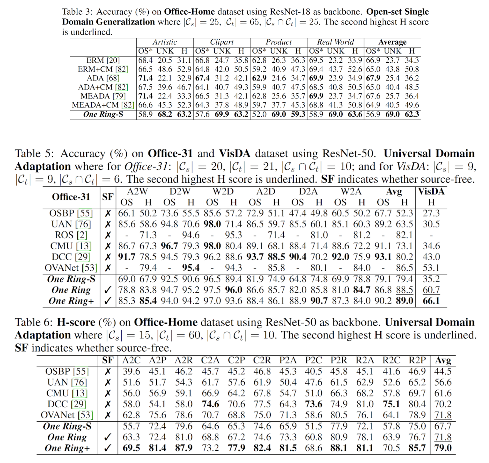

# One Ring to Bring Them All: Towards Open-Set Recognition under Domain Shift 	

### _Shiqi Yang, Yaxing Wang, Kai Wang, Shangling Jui and Joost van de Weijer_

_**Keyworkds: Open-set Recognition; Open-set Single Domain Generalization; Source-free Universal Domain Adaptation**_

------------
Code for our paper **'One Ring to Bring Them All: Towards Open-Set Recognition under Domain Shift'** 

[[project]](https://sites.google.com/view/one-ring)[[arxiv]](https://arxiv.org/abs/2206.03600)

**We will release the code if accepted.**

## Demo for our **OneRing** classifier

**Trained on 3 known categories.**

## **Experimental results**

### **Reference**

> @article{Yang2022OneRT,\
  title={One Ring to Bring Them All: Towards Open-Set Recognition under Domain Shift},\
  author={Yang, Shiqi and Wang, Yaxing and Wang, Kai and Jui, Shangling and van de Weijer, Joost},\
  journal={arXiv preprint arXiv:2205.03600},\
  year={2022}\
}
